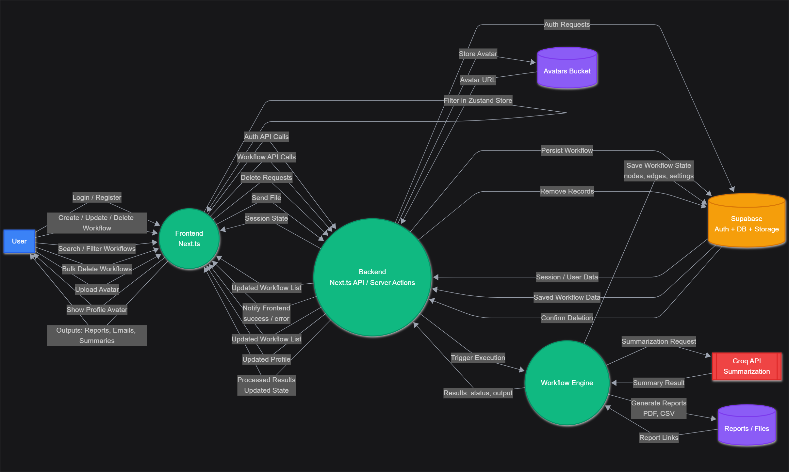
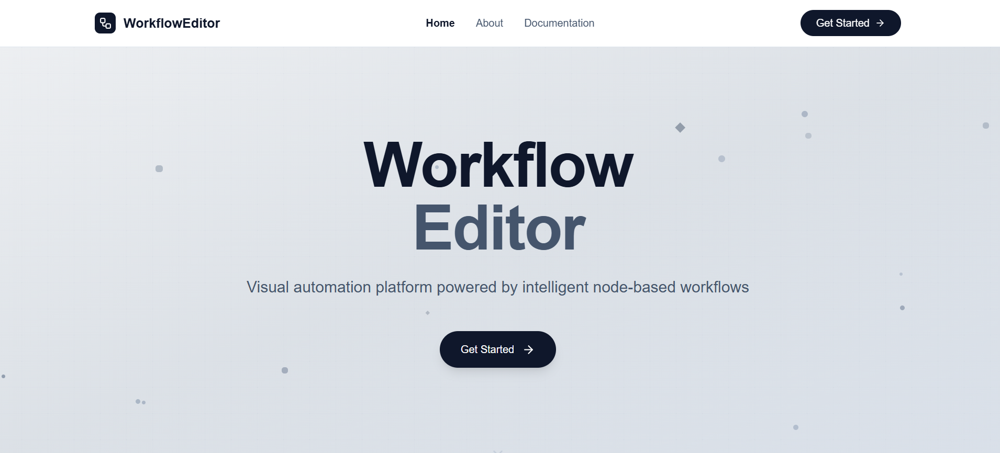

# Workflow Automation Platform

**Author:** Omar Mohamed Farouq  
**Date:** Aug 30, 2025

## Overview

The Workflow Automation Platform allows users to design, execute, and manage workflows in a visual editor. Users can build workflows with nodes and connections, trigger executions, and view summarized results in reports (PDF/CSV/DOCX).

The system integrates with:

- **Supabase** (Auth, Database, Storage)
- **Groq API** (text summarization)
- **Next.js + Zustand** (frontend, state management, server actions)

---

## Goals & Objectives

This platform enables developers and users to:

- Register, log in, and manage profiles (with avatars).
- Create, edit, and delete workflows.
- Execute workflows and receive summarized results.
- View, filter, and bulk delete workflows.
- Export results as **PDF/CSV/DOCX reports**.
- Provide a fast and scalable experience with Next.js and Supabase.

---

## Key Features

### Authentication & User Management

- Email/password sign-up and login.
- Session management via Supabase.
- Profile management with avatar upload (stored in Supabase bucket).
- Avatars displayed across the UI.

### Workflow Management

- Create and edit workflows (nodes, edges, metadata).
- Save and retrieve workflows from Supabase.
- Bulk delete and filter workflows.

### Workflow Execution

- Trigger execution from frontend → backend → workflow engine.
- Summarization via Groq API.
- Execution states and outputs stored in Supabase.
- Reports generated (PDF/CSV) and linked to results.

### Reports & Outputs

- Downloadable **PDF/CSV reports**.
- Summarized text results from Groq.
- Execution history stored per workflow.

### Avatars

- User uploads avatar → stored in Supabase → displayed in the frontend.

---

## System Architecture

### Overview Diagram

### Sequence Diagram

For additional diagrams, see the [diagrams folder](./diagrams):

- [Activity Diagram](./diagrams/activity-diagram.png)
- [Database Schema](./diagrams/database-schema.png)
- [State Diagram](./diagrams/state-diagram.png)

---

## User Flows

### Authentication

1. User signs up or logs in.
2. Backend validates via Supabase Auth.
3. Session returned and cached in Zustand.
4. User redirected to Dashboard.

### Create Workflow

1. User clicks **New Workflow**.
2. Workflow editor opens.
3. User saves workflow → stored in Supabase.
4. Workflow appears in list.

### Execute Workflow

1. User selects workflow and clicks **Run**.
2. Backend triggers engine.
3. Engine requests Groq summarization.
4. Execution saved in Supabase.
5. Reports generated.
6. Frontend displays results with download links.

---

## Milestones & Roadmap

### Phase 1 (MVP)

- Auth (Supabase).
- Workflow CRUD.
- Execution engine (basic).
- Groq integration.
- Report generation (PDF/CSV).
- Avatars.

### Phase 2

- Bulk delete + filtering.
- Execution history.
- UI/UX improvements.
- Error handling + retries.

### Phase 3

- Email summaries.
- Real-time workflow execution visualization.
- Team collaboration.

---

## Packages and Technologies Used

### Frontend

- **Next.js (App Router)** – React framework for building UI and API routes
- **React & React DOM** – core UI library and rendering
- **TailwindCSS** – styling framework
- **Zustand** – state management
- **Framer Motion** – animations
- **React Flow** – workflow editor (nodes & edges)
- **Lucide React** – icons
- **React Hot Toast** – notifications

### Backend / Utilities

- **Supabase (`@supabase/supabase-js`, `@supabase/ssr`)** – authentication, database, storage
- **Groq SDK (`groq-sdk`)** – text summarization API
- **PDF-lib** – generating PDF reports
- **Docx** – generating Word documents
- **Mammoth** – extracting text from DOCX files
- **PapaParse** – CSV parsing
- **Nodemailer** – sending emails

### Development Tools

- **TypeScript** – type safety
- **ESLint** (`eslint`, `eslint-config-next`, `@eslint/eslintrc`) – linting and code style
- **@types/...** – TypeScript type definitions
- **PostCSS (`@tailwindcss/postcss`)** – Tailwind CSS processing

---

## UI Screenshots

Screenshots are available in the [images folder](./public/images):

### Home

### Sign In

### Dashboard

### Editor

